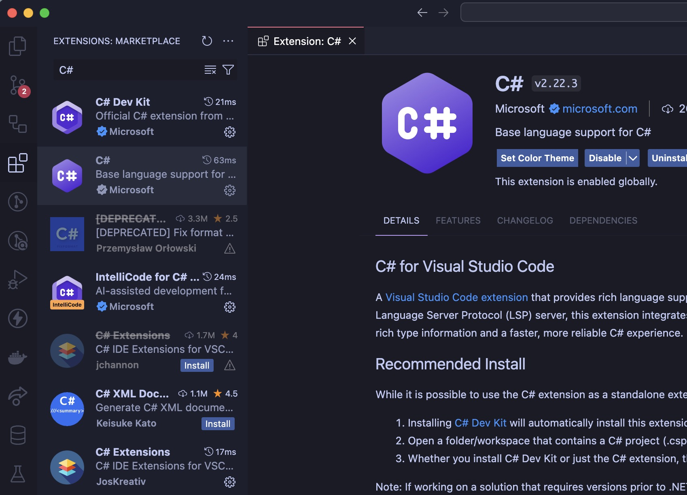

# C# pour Visual Studio Code

## Table des matières

- [C# pour Visual Studio Code](#c-pour-visual-studio-code)
  - [Table des matières](#table-des-matières)
  - [Introduction](#introduction)
  - [Prérequis](#prérequis)
  - [Étape 1 : Installer le SDK .NET](#étape-1-installer-le-sdk-net)
  - [Étape 2 : Installer Visual Studio Code](#étape-2-installer-visual-studio-code)
    - [Windows](#windows)
    - [MacOS](#macos)
    - [Linux](#linux)
  - [Étape 3 : Installer l’extension C](#étape-3-installer-lextension-c)
  - [Bonus : Outils de développement](#bonus-outils-de-développement)
  - [Pour aller plus loin](#pour-aller-plus-loin)

## Introduction

Ce guide vous aidera à configurer votre environnement de développement pour C# en utilisant Visual Studio Code. Il vous guidera à travers l’installation du SDK .NET, de Visual Studio Code et de l’extension C# pour une configuration complète.

## Prérequis

- Un ordinateur.

## Étape 1 : Installer le SDK .NET

Le SDK .NET est une plateforme de développement gratuite et open source permettant de créer différents types d’applications. Il inclut le compilateur C#, le runtime .NET et le runtime ASP.NET Core.

1. Téléchargez l’installeur du SDK .NET depuis le [site officiel](https://dotnet.microsoft.com/download).
2. Exécutez l’installeur et suivez les instructions.
3. Une fois installé, ouvrez un nouveau terminal et exécutez la commande suivante pour vérifier l’installation :

```bash
dotnet --version
```

## Étape 2 : Installer Visual Studio Code

Visual Studio Code est un éditeur de code source gratuit développé par Microsoft pour Windows, Linux et macOS. Il prend en charge le débogage, le contrôle Git intégré, la mise en surbrillance syntaxique, l’auto-complétion intelligente, les extraits de code et le refactoring.

### Windows

1. Téléchargez l’installeur de Visual Studio Code depuis le [site officiel](https://code.visualstudio.com/).

2. Exécutez l’installeur et suivez les instructions (pensez à ajouter l’action `Ouvrir avec Code` au menu contextuel de l’Explorateur Windows).

3. Une fois installé, ouvrez Visual Studio Code.

4. Cliquez sur `File` > `Auto Save` pour activer l’enregistrement automatique.

### MacOS

1. Téléchargez l’installeur de Visual Studio Code depuis le [site officiel](https://code.visualstudio.com/) ou utilisez la commande suivante dans le terminal :

```bash
brew install --cask visual-studio-code
```

2. (Ignorez si vous avez utilisé brew) Ouvrez le fichier téléchargé et glissez l’icône Visual Studio Code dans le dossier Applications.

3. Une fois installé, ouvrez Visual Studio Code.

4. Ouvrez la palette de commandes (`Ctrl+Shift+P`) et tapez `shell command` pour trouver la commande `Shell Command: Install 'code' command in PATH`.

5. Cliquez sur `File` > `Auto Save` pour activer l’enregistrement automatique.

### Linux

1. Téléchargez l’installeur de Visual Studio Code depuis le [site officiel](https://code.visualstudio.com/download) (disponible au format `.deb` ou `.rpm`). Vous pouvez aussi consulter la [version Insiders de Visual Studio Code](https://code.visualstudio.com/insiders/) pour plus de disponibilité.

2. Exécutez l’installeur et suivez les instructions.

3. Une fois installé, ouvrez Visual Studio Code.

4. Ouvrez la palette de commandes (`Ctrl+Shift+P`) et tapez `shell command` pour trouver la commande `Shell Command: Install 'code' command in PATH`.

5. Cliquez sur `File` > `Auto Save` pour activer l’enregistrement automatique.

## Étape 3 : Installer l’extension C #

L’extension C# pour Visual Studio Code ajoute la prise en charge de C# à Visual Studio Code, avec notamment la coloration syntaxique, IntelliSense (auto-complétion) et le débogage.

Trouvez-les ici :



Les extensions à installer sont :

- [C#](https://marketplace.visualstudio.com/items?itemName=ms-dotnettools.csharp)
- [C# Extensions](https://marketplace.visualstudio.com/items?itemName=jchannon.csharpextensions)
- [C# Dev Kit](https://marketplace.visualstudio.com/items?itemName=ms-dotnettools.csdevkit)

## Bonus : Outils de développement

Les extensions suivantes ne sont pas indispensables mais peuvent être utiles :

- [CSharpier](https://marketplace.visualstudio.com/items?itemName=csharpier.csharpier-vscode)
- [tokyo-night](https://marketplace.visualstudio.com/items?itemName=Avetis.tokyo-night)
- [Reload](https://marketplace.visualstudio.com/items?itemName=natqe.reload)

Ouvrez un terminal et exécutez la commande suivante pour installer CSharpier (formateur de code) :

```bash
dotnet tool install --global csharpier
```

Ensuite, ouvrez le menu KeyboardShortcuts :


Recherchez `Format Document` et affectez la touche de raccourci `Ctrl+S` (ou `Cmd+S` sur macOS)


Enfin, ouvrez un fichier C# et appuyez sur `Ctrl+S` (`Cmd+S` sur macOS) pour formater le document.

## Pour aller plus loin

- [Documentation officielle](https://code.visualstudio.com/Docs/languages/csharp)

---

Dernière mise à jour : Mai 2024

Auteur : [Yann M. Vidamment](https://github.com/MorganKryze)
